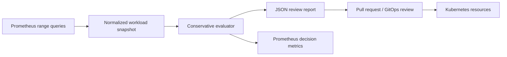

# Kubernetes Capacity Forecaster

A conservative, review-first capacity analysis tool for Kubernetes workloads.
It compares observed CPU/memory peaks against declared requests and limits,
generates an explainable recommendation, and emits Prometheus metrics for the
decision state. It never mutates a cluster or automatically changes resources.

## Why it exists

Capacity failures and excessive requests both hurt reliability: the first causes
throttling/OOM risk; the second reduces schedulable capacity and inflates cost.
This project demonstrates a safe operational loop: collect → analyze → review →
apply through normal GitOps controls.

## Architecture



## Safety model

- The input snapshot is explicit and versionable; recommendations are not based
  on opaque live-cluster mutations.
- A `high` recommendation requires both peak and percentile signals to exceed
  the request. Missing data produces `insufficient_data`, not a resize.
- Requests are rounded up, constrained by a safety buffer, and accompanied by
  the observed values that caused the decision.
- An operator must validate application semantics, HPA/VPA configuration,
  startup peaks and PDB implications before applying a change.

## Try it

```bash
python3 -m capacity_forecaster.cli \
  --input examples/workload-snapshot.json \
  --report /tmp/capacity-report.json \
  --metrics /tmp/capacity_forecaster.prom
```

The snapshot can be generated by an approved collector that queries
Prometheus. The schema intentionally accepts already-normalized values to keep
credentials and cluster connectivity outside this review tool.

## Contents

- `src/`: evaluator and CLI, implemented with Python standard library only.
- `examples/`: normalized sample input; it is illustrative data, not production evidence.
- `grafana/`: dashboard queries for recommendation state and utilization.
- `docs/`: query contract, runbook and threat model.
- `.github/`: test and lint workflow.

## Validation

```bash
python3 -m pytest
ruff check src tests
```

## License

MIT. Copyright (c) 2026 Hamidreza Mohammadi.
